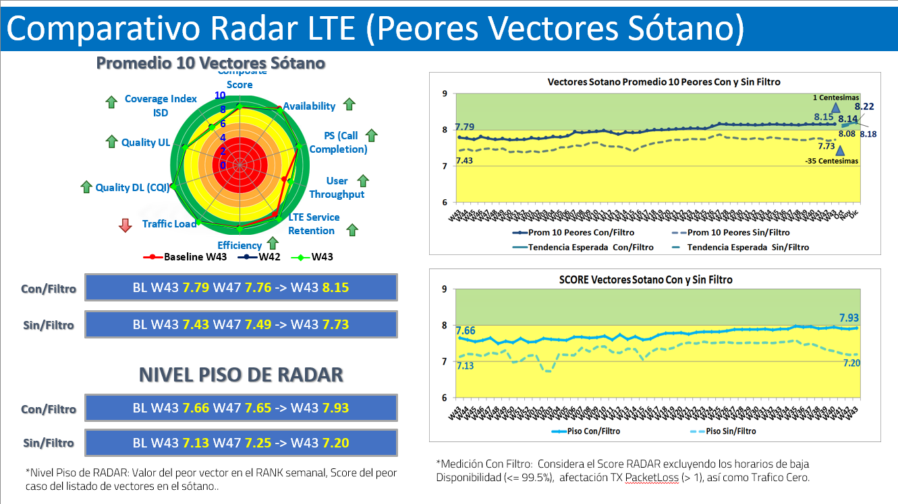
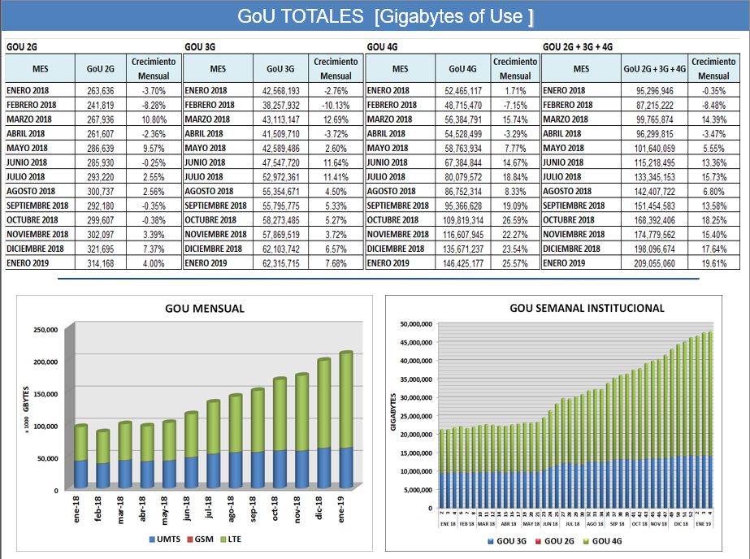
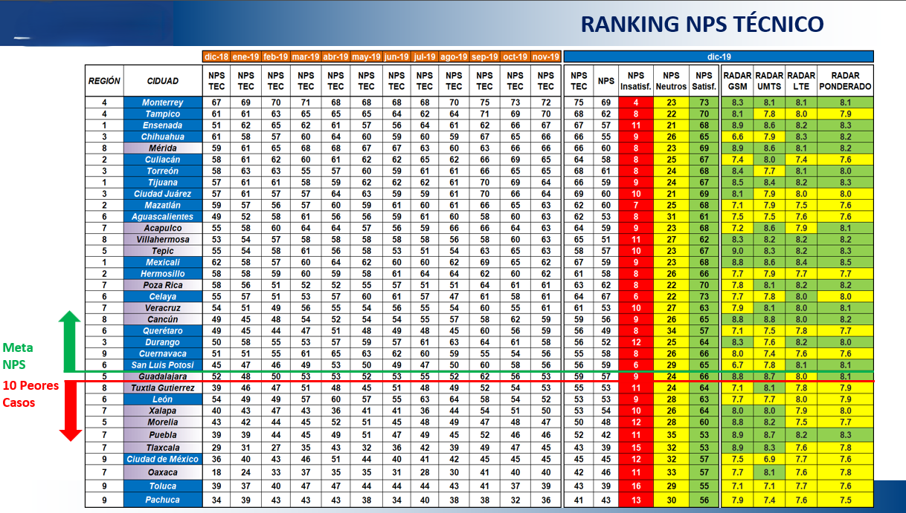
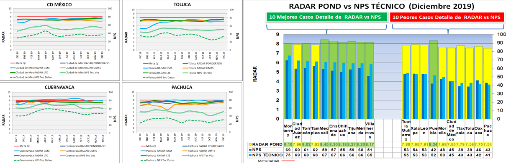
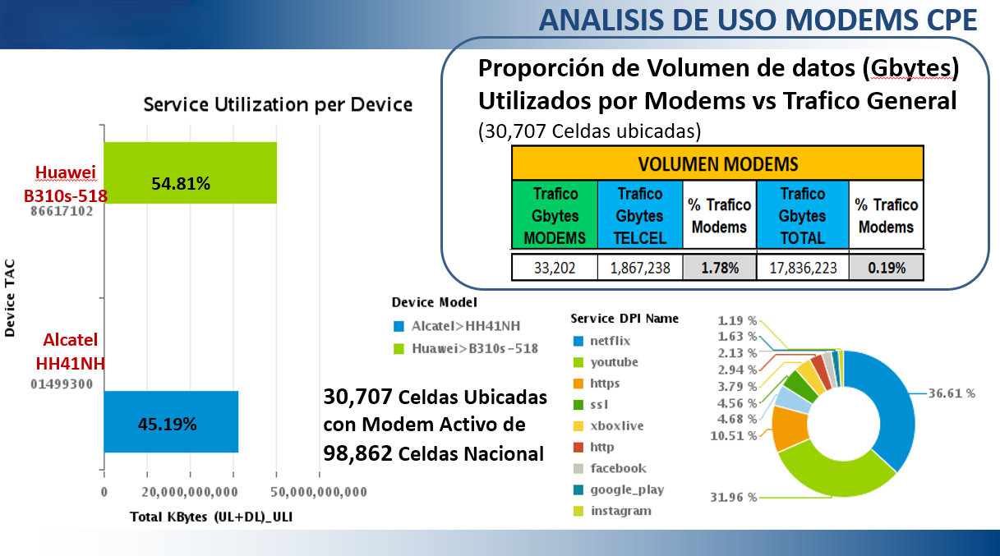
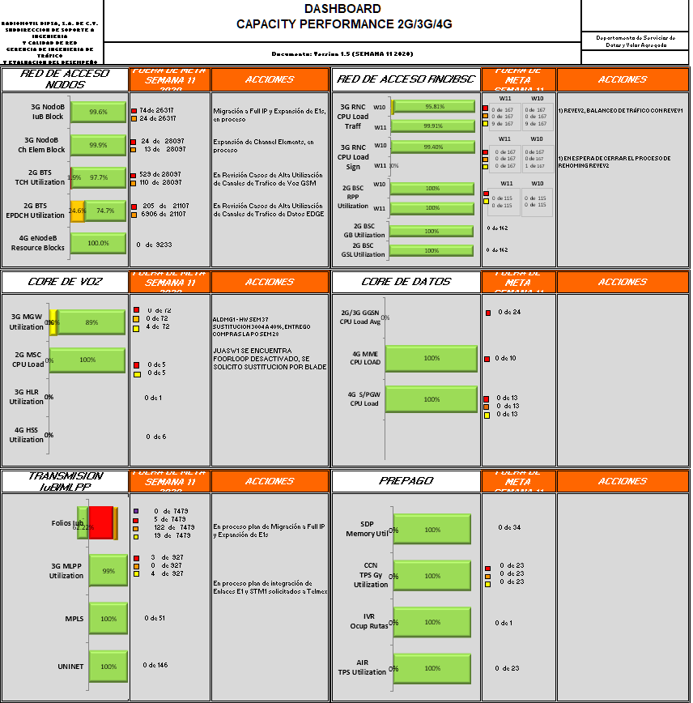
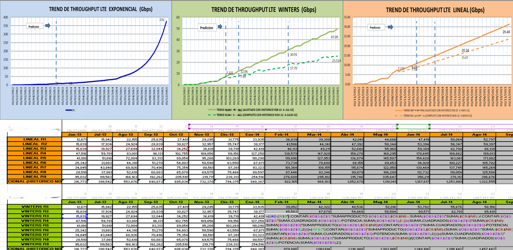
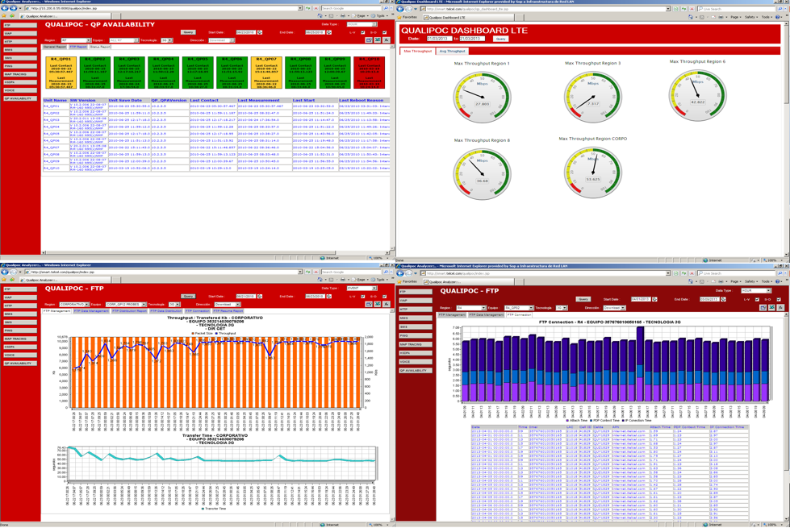
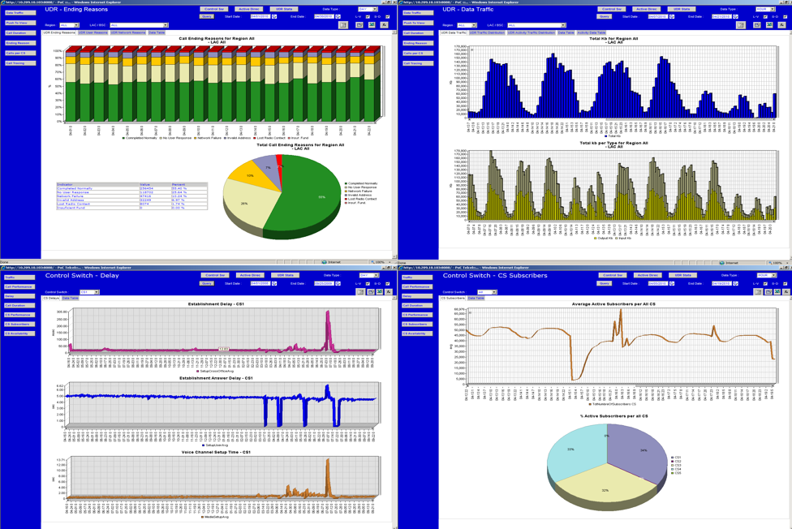

# Telecomunications Dashboards
Part of my Data Management and Visualization projects.

Experienced IT Professional with two decades of expertise in data lifecycle management and analytics. Telecommunications specialist adept at transforming complex data into strategic insights through interactive dashboards and KPI analysis.

## Dashboards

### 1. [LTE RADAR] 

---

### 2. [GoU] 

---

### 3. [NPS Vs RADAR LTE] 

---

### 4. [Use of Modems] 

---

### 5. [Capacity Performance] 

---

### 6. [Forecasting time series Data (Winters Method)] 

---

### 7. [Qualipoc Analyzer] 

---

### 8. [Push To Talk Metrics] 

